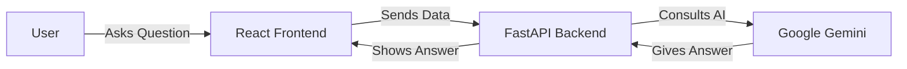

# How It Works (System Design)
**Project Name:** AI DevCompanion  

---

## 1. The Big Picture
Think of **AI DevCompanion** as a smart translator between you and your computer. You give it confusing errors or code, and it gives you back improved, easy-to-understand explanations.

It works in two main parts:
1.  **The Frontend (What You See):** A beautiful website where you type or paste your problem.
2.  **The Backend (The Brain):** A server that takes your problem, asks a super-smart AI (Google Gemini) for the answer, and sends it back to you.

### Simple Diagram

## 2. The Frontend (The Website)
We built the website using **React 19**, which makes it super fast and interactive.
*   **Design:** We used **TailwindCSS** to give it a modern "Dark Mode" look with glowing neon accents.
*   **Glassmorphism:** You'll notice the result cards look like frosted glass. This isn't just for looks; it helps separate the important information from the background.
*   **Animations:** We added smooth motions (using **Framer Motion**) so the app feels alive when you click buttons or switch tabs.

## 3. The Backend (The Engine)
The backend is written in **Python**, the same language used by data scientists and AI researchers. It uses a framework called **FastAPI**, which is known for being incredibly fast.

### What happens when you click "Analyze"?
1.  **Validation:** The server checks if you actually sent text (and not something empty).
2.  **Prompt Engineering:** Providing raw text to an AI isn't enough. Our server wraps your error in a special "instruction manual" (a prompt) that tells the AI: *"You are a senior developer. Explain this error to a beginner."*
3.  **AI Processing:** It sends this package to **Google Gemini**.
4.  **Response:** The AI sends back the answer, and our server makes sure it's formatted correctly before showing it to you.

## 4. Key Technologies
*   **Language:** Python 3.10+ (Logic) & JavaScript (Interface)
*   **AI Model:** Google Gemini Pro (via `google-genai` SDK)
*   **Styling:** TailwindCSS v4
*   **Icons:** Lucide React

## 5. Security & Privacy
*   **No Database:** We don't store your code. Once the analysis is done, it's forgotten.
*   **Secure Keys:** The keys to access the AI are hidden safely on the server, so no one can steal them.
